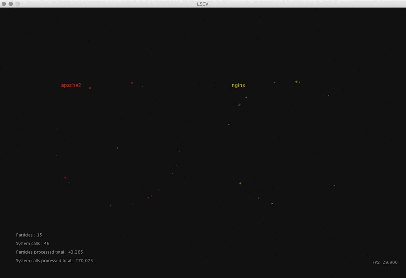

# LSCV : Linux System Call Visualization

Exploring a real-time visualization of applications activity (via systems calls) on Linux.

## Goals

* Explore different techniques of data visualization.
* Get a better understanding of applications and systems behaviour.
* Find abnormal activity and diagnose potentials performance problems.

## Getting started

LSCV consist of a server module for collecting the data (using [Sysdig](http://www.sysdig.org/) ) and sending it (via [Redis](http://redis.io/) publish-subscribe) to a [Processing](https://www.processing.org/) client application that display it.

To get started with LSCV : first install the server module on the Linux system you wish to instrument (or create a Ubuntu virtual machine using the Vagrant script provided), then on another machine you can download the client app .jar and launch it. 

All the source code and the installation instructions are on Github :

The server module : [https://github.com/francisbonneau/lscv-server](https://github.com/francisbonneau/lscv-server)

The client application : [https://github.com/francisbonneau/lscv-client](https://github.com/francisbonneau/lscv-client)

The project doc (in french) : [https://francisbonneau.github.io/lscv-doc/](https://francisbonneau.github.io/lscv-doc/)

## About

Project created for the course GTI792 at [l'École de technologie supérieure (ÉTS)](http://www.etsmtl.ca/) by Francis Bonneau under the supervision of Michael J. McGuffin, Ph.D.

